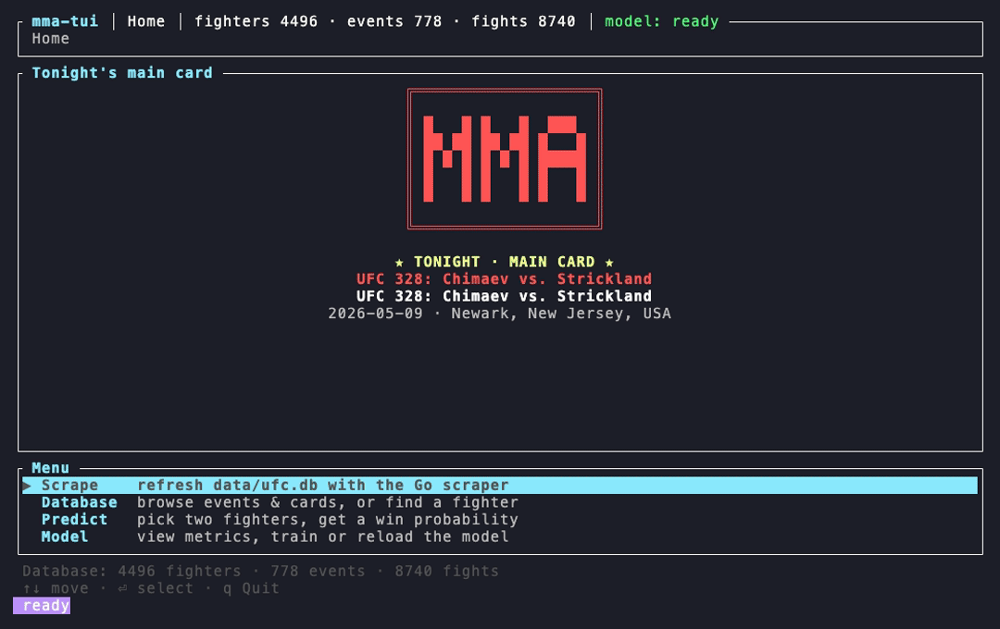

# MMA Stats Pipeline

-blue.svg)


A local, end-to-end toolkit for UFC fight statistics. A concurrent Go scraper
pulls fighter, event, and fight data from [ufcstats.com](http://ufcstats.com)
into one SQLite file; a Python ML layer reads it to find fighter archetypes, mine
stat relationships, and predict fight outcomes; and a Rust terminal UI ties it all
together as a single control center. Everything runs on your machine — point it at
a database, scrape, analyse, and run matchups from one screen.



## Features

- **Concurrent, incremental scraper** — pulls fighters, events, and fights from
  [ufcstats.com](http://ufcstats.com). After the first run it only fetches what's
  new, throttles its own requests, and clears the site's bot-check automatically.
- **Fighter archetypes** — groups fighters by fighting style and labels each with a
  readable name (e.g. *takedown-heavy grappler*, *rangy knockout artist*).
- **Stat relationships** — finds and charts how fighter stats relate to one another.
- **Fight-outcome predictor** — estimates the odds of one fighter beating another,
  at around 60–65% accuracy on held-out fights. You can also:
  - compare fighters at **any point in their career** — their latest form, their
    **prime** (their estimated peak), or a specific past fight;
  - see **win-by-method odds** — decision / KO-TKO / submission — as a breakdown
    that adds up to 100%.
- **Terminal UI** — the main way to use the project: fuzzy fighter search, the
  predictor, plain-English stat explanations, and an animated loading screen. It
  runs the scraper on demand and loads the prediction model once in the background.

## Architecture

```
  you ── launch ─▶  mma  (Rust TUI, tui-rs/)
                      │ runs          │ predictions      │ reads
                      ▼               ▼                  ▼ (read-only)
              ┌─────────────┐  ┌──────────────┐  ┌──────────────┐
   scrape ──▶ │  Go scraper │─▶│  data/ufc.db │◀─│  Python ML   │
   ufcstats   │ (scraper-go)│  │   (SQLite)   │  │    (ml/)     │
              └─────────────┘  └──────────────┘  └──────────────┘
```

You launch one thing — the terminal UI. It runs the scraper when you want fresh
data, reads the shared SQLite database, and gets predictions from the Python ML
code. The scraper is the only part that writes the database; everything else opens
it read-only. The schema both sides rely on is documented in
[docs/SCHEMA_CONTRACT.md](docs/SCHEMA_CONTRACT.md).

## Tech stack & requirements

| Component | Language / runtime | Key libraries |
|---|---|---|
| `scraper-go/` | Go 1.26+ (no CGO) | goquery, `golang.org/x/time`, `modernc.org/sqlite` |
| `ml/` | Python 3.10+ (3.11 tested) | pandas, numpy, scikit-learn, matplotlib, seaborn, mlxtend (umap optional), joblib |
| `tui-rs/` | Rust (stable) | ratatui, rusqlite, ratatui-image |
| storage | SQLite (WAL) | shared `data/ufc.db` (committed) |

The trained predictor lives at `ml/models/predictor.joblib` (gitignored);
regenerate it with `make train`. On macOS the toolchains install in one line:

```sh
brew install git python rust go
```

## Installation

Both methods build from source and install into a user-writable location.

### Option A — curl \| sh (macOS / Linux)

```sh
curl -fsSL https://raw.githubusercontent.com/jibi21212/mma-stats-pipeline/main/install.sh | sh
mma
```

Clones into `~/.local/share/mma-stats-pipeline` (override with `$MMA_HOME`), builds
from source, and symlinks the `mma` launcher into `~/.local/bin`. Re-running updates
the install.

### Option B — from a clone (development)

```sh
git clone https://github.com/jibi21212/mma-stats-pipeline.git
cd mma-stats-pipeline
./mma          # first run builds from source, then launches
```

Run `scripts/setup.sh --install-deps` to let the setup `brew install` any missing
toolchains on macOS.

## Usage

The TUI is the control center — from one screen you can scrape, train or load the
model, search fighters, and run predictions. From the repo root:

```sh
./mma          # launch the TUI (one-time optimised build on first run)
make run       # same thing
make help      # list every task
```

Other root tasks:

```sh
make dev       # launch the TUI in debug mode (faster compile)
make build     # optimised TUI binary + Go scraper binary
make train     # train / retrain the fight-outcome predictor
make test      # all suites: Rust (cargo) + Python (pytest) + Go (go test)
make e2e       # end-to-end tests (PTY suite + tmux smoke; offline)
make clean     # remove build artifacts
```

### Run components individually (advanced)

```sh
# Scrape into ../data/ufc.db (incremental by default; --full re-fetches everything)
cd scraper-go && go run .

# Archetype + relationship analysis -> ml/outputs/ (CSVs + PNGs)
cd ml && pip install -r requirements.txt && python run_all.py --min-fights 5 --k 6

# Train the predictor, then run a matchup (try --as-of-a prime / --as-of-b prime)
cd ml && python predict.py --train
cd ml && python predict.py --a "Israel Adesanya" --b "Robert Whittaker"
```

See each component's README for the full flag reference.

## Project structure

```
mma-stats-pipeline/
├── mma                      Launcher: builds on first run, then starts the TUI
├── Makefile                 Root task hub (run / build / test / train / …)
├── install.sh               curl | sh installer
├── tui-rs/                  Rust terminal UI (the control center)
├── scraper-go/              Go scraper — sole writer of data/ufc.db
├── ml/                      Python ML: archetypes, relationships, predictor
│   ├── run_all.py           Unsupervised analysis CLI
│   ├── predict.py           Fight-outcome predictor (+ prime / method probs)
│   ├── serve.py             Long-lived sidecar the TUI talks to
│   └── models/              Trained predictor.joblib (gitignored)
├── data/ufc.db              Shared SQLite database (committed)
├── scripts/                 setup.sh, verify.py, tui_smoke.sh
└── docs/SCHEMA_CONTRACT.md  Authoritative DB schema + value conventions
```

## Data & schema

`data/ufc.db` holds four tables — `fighters`, `events`, `fights`, `round_stats`.
Conventions: percentages are stored as `0..1` fractions, height/reach in inches,
weight in lbs, times in seconds, dates as ISO `YYYY-MM-DD`. The full DDL and
conventions are in [docs/SCHEMA_CONTRACT.md](docs/SCHEMA_CONTRACT.md).

## Tests

```sh
make test                                    # everything
cd ml && python -m pytest -q                 # Python (run from ml/)
cd scraper-go && go test ./...               # Go (offline fixtures)
cargo test --manifest-path tui-rs/Cargo.toml # Rust
```

The Python tests build a synthetic in-memory database, and the Go and Rust suites
use inline fixtures, so no scraped data is required to run them.

## Documentation

- [scraper-go/README.md](scraper-go/README.md) — Go scraper: build, run, flags, anti-bot handling.
- [ml/README.md](ml/README.md) — Python ML: install, outputs, predictor deep-dive.
- [tui-rs/README.md](tui-rs/README.md) — terminal UI internals and the sidecar protocol.
- [docs/SCHEMA_CONTRACT.md](docs/SCHEMA_CONTRACT.md) — the shared schema both halves rely on.

## Acknowledgements

Fight data is scraped from [ufcstats.com](http://ufcstats.com) for personal,
non-commercial analysis.

## License

[MIT License](https://opensource.org/license/mit) with the
[Commons Clause](https://commonsclause.com/) — see [LICENSE](LICENSE). You're free
to use, copy, and modify this, but you may **not sell** the software or a paid
product/service whose value derives substantially from it. (This makes the project
*source-available*, not OSI open-source.)
